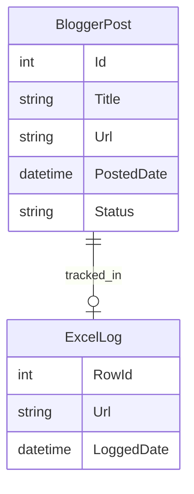

# BloggerExplore_Python

**BloggerExplore_Python** is a Python project designed to automate the publishing and updating of posts on Blogger using the official Blogger API. It further tracks all published posts by inserting the latest post URLs into an Excel spreadsheet, making it easy to manage and audit your content workflow.

---

## Features

- **Create & Update Blogger Posts:** Programmatically insert new posts or update existing ones using the Blogger API.
- **Track Published URLs in Excel:** Automatically log each published post’s URL in an Excel file to maintain a posting record.
- **Bulk Posting Support:** Easily handle multiple posts in one go.
- **Status & Error Logging:** Get clear feedback on every operation.

---

## Technologies Used

- **Python 3.x:** Main programming language.
- **Blogger API:** For creating and updating posts on Blogger.
- **Google Auth Libraries:** For authentication (OAuth 2.0 / Service Account).
- **openpyxl:** For reading/writing Excel files.
- **Requests:** For HTTP API calls.
- **Logging:** Python standard logging for feedback and errors.

---

## Typical Workflow

1. **Authenticate:** Set up Google credentials for Blogger API access.
2. **Prepare Post Data:** Fill your post details in the script or read from a file.
3. **Publish or Update:** Run the script to insert or update posts on Blogger.
4. **Track URL:** After posting, the script adds the post's URL to an Excel file.
5. **Audit & Review:** Use the Excel file to track all posted URLs.

---

## Example Usage

```python
import openpyxl
from googleapiclient.discovery import build
from google.oauth2 import service_account

# Authenticate
SCOPES = ["https://www.googleapis.com/auth/blogger"]
SERVICE_ACCOUNT_FILE = "service-account.json"
credentials = service_account.Credentials.from_service_account_file(
    SERVICE_ACCOUNT_FILE, scopes=SCOPES)
blogger = build("blogger", "v3", credentials=credentials)

# Insert a new post
post_body = {
    "title": "My New Post",
    "content": "<p>This is the post content.</p>"
}
blog_id = "YOUR_BLOG_ID"
post = blogger.posts().insert(blogId=blog_id, body=post_body).execute()

# Log URL in Excel
wb = openpyxl.load_workbook("posts.xlsx")
ws = wb.active
ws.append([post["url"]])
wb.save("posts.xlsx")
```

---

## Data Model (ER Diagram Example)



---

## Getting Started

1. Clone the repository.
2. Set up a Google Cloud project and enable the Blogger API.
3. Create a service account and download the credentials JSON file.
4. Create an Excel file (`posts.xlsx`) for tracking (or let the script generate one).
5. Run the Python scripts to publish or update posts and log URLs.

---

## License

This project uses open-source libraries (`openpyxl`, `google-api-python-client`, etc.) and Google APIs.
See individual library documentation for licensing details.

---

## Author

Ashish Saurav

---

## Contributing

Pull requests, feature suggestions, and bug reports are welcome.
